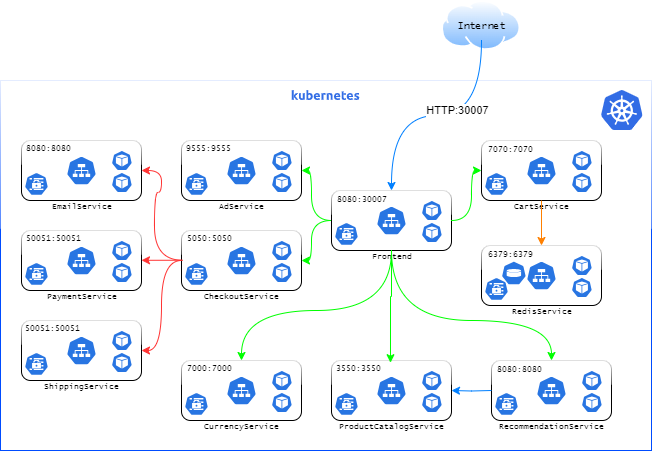

---

# Online Store Deployment Using Kubernetes

This project demonstrates the deployment of an e-commerce application using Kubernetes, leveraging a microservices architecture for scalability, resilience, and maintainability.<br>



## Key Features

- **Microservices Architecture**: The application is split into multiple independent services such as `PaymentService`, `CartService`, `ShippingService`, `CheckoutService`, and more, each running in its own container.
- **Kubernetes for Orchestration**: All services are deployed and managed through Kubernetes, ensuring high availability, fault tolerance, and auto-scaling.
- **Service Communication**: Services communicate internally via Kubernetes service discovery. The frontend is exposed to external users using a `NodePort`.
- **Redis Integration**: Redis is used for caching and session management to speed up data retrieval and improve overall performance.
- **Automatic Scaling and Self-Healing**: Kubernetes handles auto-scaling of the services based on demand and ensures system resilience through its self-healing capabilities.
  
## Architecture Overview

The architecture consists of the following services:
- **Frontend Service** (`8080:30007`): Serves the UI and interacts with backend services.
- **Email Service** (`8080:8080`): Sends notifications to users.
- **Payment Service** (`50051:50051`): Manages payment transactions.
- **Shipping Service** (`50051:50051`): Tracks and manages shipping.
- **AdService** (`9555:9555`): Displays advertisements to users.
- **Checkout Service** (`5050:5050`): Manages the checkout process.
- **Currency Service** (`7000:7000`): Handles currency conversions.
- **Product Catalog Service** (`3550:3550`): Manages product inventory.
- **Recommendation Service** (`8080:8080`): Provides product recommendations.
- **Cart Service** (`7070:7070`): Manages shopping cart functionality.
- **Redis Service** (`6379:6379`): Caching layer for faster data access.

## Deployment Strategy

- Each service is containerized using Docker and deployed on Kubernetes clusters.
- Services are exposed and managed via Kubernetes deployments and services.
- NodePort exposes the frontend to external users, while internal services communicate securely within the cluster.

## How to Run

1. Clone the repository.
2. Deploy the Kubernetes manifests using `kubectl`:
    ```bash
    kubectl apply -f k8s/
    ```
3. Access the frontend via the NodePort at `http://<NODE-IP>:30007`.

---
